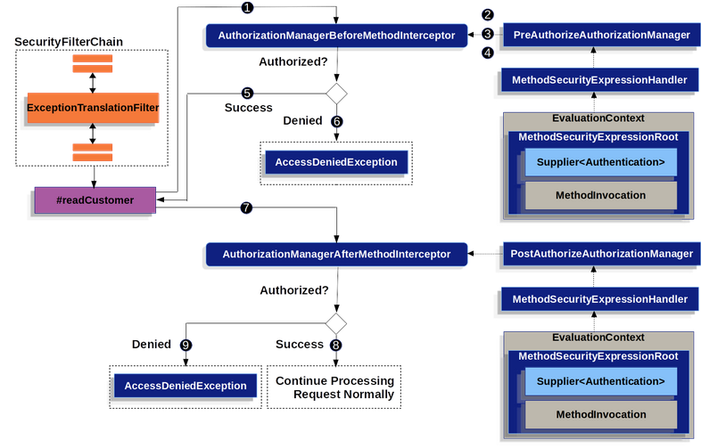

  

### Each Annotation Has Its Own Method Interceptor
#
### Annotations && Benefits
- Fine-grained authorization; depends on the method being called for authorization  
- Enforcing security at the service layer  
- easy to implement  
####
- `@PreAuthorize`
- `@PostAuthorize`
- `@PreFilter`
- `@PostFilter`
- `@Secured` -> Legacy, `@PreAuthorize` supercedes it and is recommended instead. use it enabling in `@EnableMethodSecurity`

ALL work on any Spring bean
